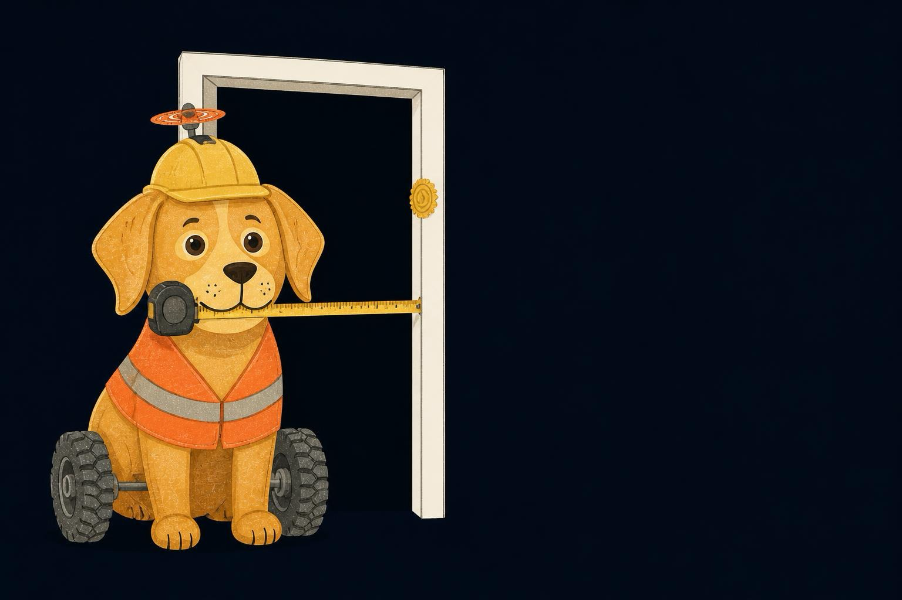
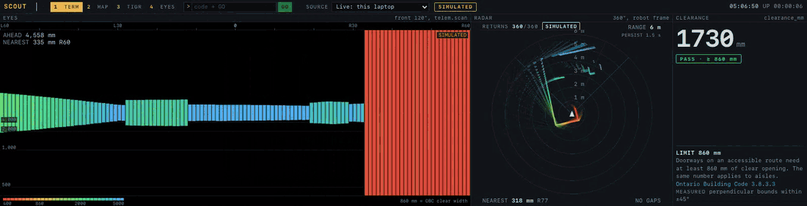
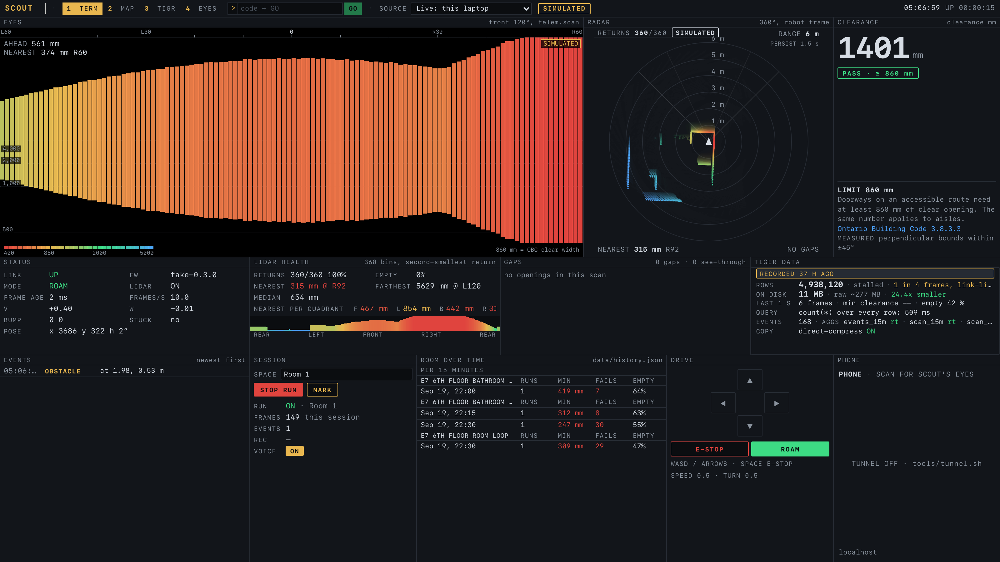
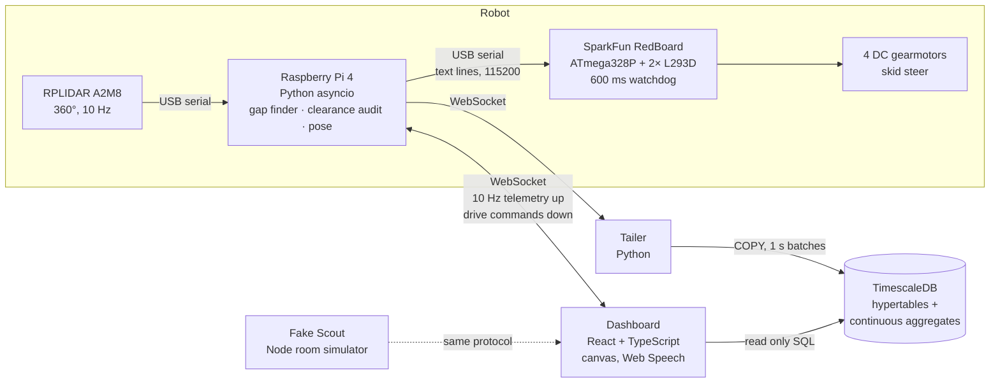

<p align="center">
  
</p>

<h1 align="center">Scout</h1>

<p align="center">
  <b>A lidar rover that goes through a building first and measures whether a wheelchair fits.</b><br>
  Raspberry Pi 4 · RPLIDAR A2M8 · AVR motor firmware · Python asyncio · React · TimescaleDB<br>
  Built in 32 hours at <a href="https://hackthenorth.com">Hack the North 2026</a>
</p>

<p align="center">
  <a href="https://github.com/aikhanjum/scout/actions/workflows/ci.yml"></a>
  
  
  
  
</p>

---

> *"Too narrow between a wall and an obstacle. 51 centimeters. A wheelchair needs 86."*
>
> Scout says that out loud the moment it finds a barrier.

Ontario's building code says a doorway on an accessible route needs **860 mm** of clear width. Almost nobody checks, and a room that passes on paper gets blocked by chairs and backpacks the next day. Scout drives through a space, reads a full 360° lidar ring ten times a second, finds the two nearest solid edges on either side of its path, and checks the gap against 860 mm. Pass or fail is spoken, logged, and streamed beam by beam into a time series database so any room can be queried again hours later.

<p align="center">
  
</p>

## Results, measured on real hardware

| | |
| --- | --- |
| **Doorway accuracy** | **878 mm** measured vs **880 mm** by tape, a 2 mm error ([docs/ACCURACY.md](docs/ACCURACY.md)) |
| **Sensing rate** | 360 beams × 10 Hz = **3,600 samples/s**, every one judged and stored |
| **Ingest** | Live COPY into a TimescaleDB hypertable, **3,600 rows/s** sustained while driving |
| **Query** | `count(*)` over **3.78 M** beam rows in **127 ms** on a free 0.5 vCPU instance |
| **Storage** | 117 MB raw → **4.16 MB** on disk, **28× compression** in the columnstore |
| **Safety** | Motors stop on their own after **600 ms** without a command, enforced on the MCU |
| **Scan matcher** | **2.1 ms** per scan, 17 mm drift over a 646 scan simulated run (see the honest part below) |

## The terminal

A Bloomberg style operator console. Mnemonic screens (`TERM` `MAP` `TIGR` `EYES`), a command line, fourteen live tiles, and drive keys that light up. Any phone that scans the QR code gets Scout's raw lidar view through a Cloudflare tunnel.

<p align="center">
  
</p>

Everything in the screenshots above is the fake Scout running on a laptop, which is why the corner says `SIMULATED`. The dashboard marks simulated data everywhere it appears, and the database refuses to mix it into real numbers.

## Architecture



| Layer | What it does | Code |
| --- | --- | --- |
| **Firmware** | Bare register drive of the shield's SN74HC595 shift register, no motor library. Parses `<L> <R>` text commands, acks each one, and stops itself after 600 ms of silence. | [`firmware/redboard`](firmware/redboard/src/main.cpp) |
| **Brain** | One asyncio process. Two serial devices on threads, immutable snapshots instead of locks, an aiohttp server for HTTP and WebSocket. Finds both USB devices by probing what answers, never by `/dev/ttyUSB0`. Runs with either device missing. | [`pi/scout`](pi/scout) |
| **Audit** | Gap detection with evidence tags, perpendicular clearance, debouncing into events. | [`audit.py`](pi/scout/audit.py), [`gaps.py`](pi/scout/gaps.py) |
| **Dashboard** | Vite, React 19, zustand, plain 2D canvas. Replays any recorded run with the same code path as live. | [`mission-control`](mission-control) |
| **Data** | Four hypertables (`runs`, `events`, `telem`, `scan`), five real time continuous aggregates, direct to columnstore COPY. | [`tools/upload-run`](tools/upload-run) |
| **Contract** | One frozen protocol doc for serial and WebSocket. The robot, the fake and a replay file are interchangeable. | [`docs/PROTOCOL.md`](docs/PROTOCOL.md) |

## Engineering notes

**A doorway and a blind spot look identical.** A beam that passes through an open door and a beam that hits glass or matte black both come back as zero. The first gap finder called every blind arc an opening. Now every gap carries its evidence, and only one kind is allowed to fail a room.

| Tag | Meaning | Can it fail a room? |
| --- | --- | --- |
| `see_through` | A farther return was seen through the gap, so it really is open | Yes |
| `step` | The two edges are neighbouring samples, like a corner | No |
| `unverified` | Nothing came back at all | Never |

**Measuring a doorway is harder than it sounds.** The obvious version, nearest return on the left plus nearest on the right, reports a door a few millimetres wide every time Scout faces a wall, because a point dead ahead has almost no sideways offset. Clearance is instead taken across a thin slice abeam of the robot, the forward cone must be open before any gap counts, and a side that is more than 60% dropouts is refused rather than guessed. The first real doorway still read 850 mm, under the limit, because Scout was 30° off square to the frame. Square to it, the reading is 878 mm against a tape measure's 880, and [docs/ACCURACY.md](docs/ACCURACY.md) logs the skew error along with every false fail we saw.

**A slow phone could stop the robot.** A phone on cellular behind a tunnel drained the WebSocket slowly. `await ws.send_str()` held up the control loop, the motor board heard nothing for 600 ms, and the watchdog stopped Scout mid roam. The fix gives each client at most one send in flight and drops frames for slow ones, so no client can ever apply backpressure to the motors ([`server.py`](pi/scout/server.py)).

**The lidar said it was healthy and sent nothing.** It answered every status query, accepted the scan command, then streamed zero bytes. We had written the driver for an A1. The A2M8's motor only spins after an explicit PWM command through its USB adapter that the A1 does not need.

**Build against a fake, not the robot.** The protocol was frozen in hour one and a Node simulator that speaks it was built next. Four people built against the fake before a robot existed, and the real robot dropped in without a dashboard change. Recorded runs replay through the same path, with ground truth pose in every frame, so the Python algorithms are tested against data instead of vibes.

**Storing beams, not verdicts.** Every raw beam goes to the database, not just pass or fail. At 4 am we fixed a bug in the gap finder and re judged every stored scan with the new code. Continuous aggregates (`scan_15m`, `events_15m`) turn millions of rows into "minimum clearance per room per quarter hour" without the dashboard touching raw data.

## The honest part

Scout has no wheel encoders and no IMU, so it does not know where it is. We wrote a Hector style scan matcher ([`slam.py`](pi/scout/slam.py)) that holds 17 mm on simulated data, then tested it on three real walks and it drifted metres every time. We also tried BreezySLAM offline on the same recordings and a Manhattan world heading lock. Each helped and none was good enough ([docs/ACCURACY.md](docs/ACCURACY.md) has every number).

So we rebuilt everything that matters to need no position. The clearance verdict, the lidar view and the database stream all live in the robot's own frame. The map still exists, on its own tab, labelled **INFERRED**, and no verdict uses it.

| Scout checks | Scout does not check |
| --- | --- |
| Clear width between anything solid, at lidar height | Slopes and ramps (no IMU, a ramp looks like a wall) |
| Gaps made by furniture and bags, which change daily | Door thresholds and steps |
| The same room again, hours later | Door weight, handle type, reach heights |

## Run it without the robot

Needs Node 20+. No hardware.

```bash
git clone https://github.com/aikhanjum/scout.git && cd scout
npm run setup      # installs the fake Scout and the dashboard, about a minute
npm run fake       # terminal 1: a simulated robot in a simulated room on :8080
npm run dash       # terminal 2: the dashboard on :5173
```

Open `http://localhost:5173/?view=terminal` in Chrome and click once so spoken verdicts are allowed. Press **START RUN**, then **ROAM** to let it wall follow, or drive with arrows/WASD. Space is E-STOP.

Run the algorithm checks (Python 3.9+):

```bash
cd pi && python3 -m venv .venv && .venv/bin/pip install -r requirements.txt
.venv/bin/python tools/check_audit.py   # 17 clearance and debounce cases
.venv/bin/python tools/check_slam.py    # replay 646 scans through the matcher, scored against ground truth
.venv/bin/python tools/check_room.py    # drive rooms of several shapes, check for frame flips
```

CI runs all three plus a typecheck and production build of the dashboard on every push.

## Hardware

| Part | Role |
| --- | --- |
| Raspberry Pi 4 | Runs the brain as a systemd service ([`scout.service`](pi/scout.service)) |
| Slamtec RPLIDAR A2M8 | 360° ranging, 10 Hz, the only sensor |
| SparkFun RedBoard (ATmega328P) | Motor controller and hardware watchdog |
| DK Electronics motor shield (2× L293D, SN74HC595) | H bridges for four motors, driven as two sides |
| 4× DC gearmotors, 4WD chassis | Skid steer |
| Three isolated supplies | Motor pack on the shield, a power bank for the Pi, RedBoard logic over the Pi's USB. Motor spikes never reach the Pi |

Wiring and power notes are in [`hardware/PINMAP.md`](hardware/PINMAP.md). Flashing is in [`docs/HANDOFF-REDBOARD.md`](docs/HANDOFF-REDBOARD.md).

## Repo map

```
pi/               brain: lidar driver, gap finder, clearance audit, pose, protocol server
firmware/         RedBoard motor firmware (and the unused ESP32 bridge it replaced)
mission-control/  dashboard: Vite + React + TypeScript
tools/fake-scout/ fake robot and room simulator that speaks the same protocol
tools/upload-run/ live tailer and uploader into TimescaleDB
data/             rules, recorded runs, replay files
docs/             protocol, spec, accuracy log, demo runbook, what was cut and why
```

## Team

[Aikhan Jumashukurov](https://github.com/aikhanjum) · [Ryan Li](https://github.com/ryanli0070) · [Caden Sun](https://github.com/Quaden2307) · [Aidan Schreder](https://github.com/AidanSchreder) 

## What's next

Wheel encoders, so position stops being a guess. Slope, thresholds and door weight. Signing each run on the robot so nobody can edit a number afterwards. Then a map where every building starts grey, meaning nobody has measured it, and only turns green or red after a Scout has been through, with a date on it. First, though, Scout goes in front of wheelchair users, because a building code is only a stand in for a person.
